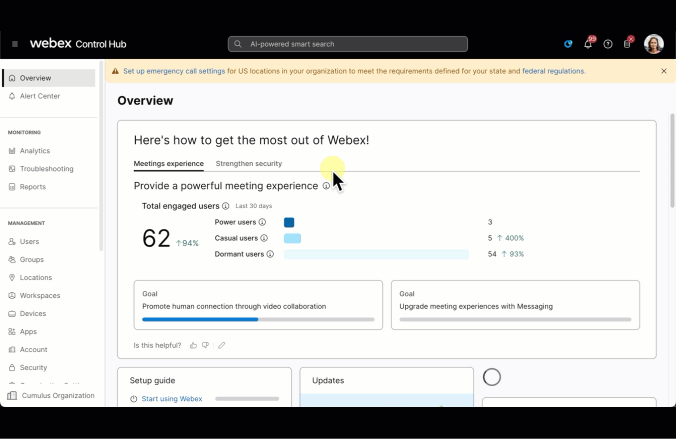

# Lab 10 - Alerts and analytics
Now that we've configured Webex Suite settings, groups, locations, and users, let's explore how to stay informed and proactive by using alerts and analytics.

### Alerts

<table>
  <colgroup>
    <col style="width:40%">
    <col style="width:60%">
  </colgroup>
  <tbody>
    <tr>
      <th>Use case and solution</th>
      <th><a href="http://admin.webex.com/" target="_blank">Control Hub</a> navigation</th>
    </tr>
    <tr>
      <td>
        This is where critical alerts created automatically by Webex services will show. Looks like you’re all caught up for now!
      </td>
      <td>
        <strong><a href="https://help.webex.com/en-us/article/mykour/Alert-Center-in-Control-Hub" target="_blank">Alert Center</a> &gt; Alerts</strong>
      </td>
    </tr>
    <tr>
      <td>
        
Let’s look how we can get notification on some that may be of importance to us.

        
We’re usually on top of these types of things, but I like all the notifications I can get!

      </td>
      <td>
        
<strong>Manage &gt; All rules</strong>

        
SSO IDP Certificate expiry

        <ul>
          <li>Email: Enable – add any email</li>
          <li>Webex space: Enable
            <ul>
              <li><em>This will create a space with the first alert. You could also use an existing space.</em></li>
            </ul>
          </li>
        </ul>
      </td>
    </tr>
    <tr>
      <td>
        
There isn’t a standard rule that meets our needs for devices, so let’s create our own. We’re choosing devices, but note that you can also create rules for Meetings and Calling.

        
RoomOS operational alerts in Control Hub inform admins about issues with Cisco RoomOS devices like Webex Boards and Desk, helping quickly detect and fix problems to keep meetings smooth.

        
That is – you can avoid those panicked calls from users that join their important meeting that is in 5 minutes!

      </td>
      <td>
        
<strong>Manage &gt; Create rule</strong>

        <ul>
          <li>Service: Devices</li>
          <li>Type – RoomOS operational alerts</li>
          <li>Severity – High</li>
          <li>Title – RoomOS Code Red</li>
          <li>Target – All devices</li>
          <li>Check email</li>
          <li>Add email</li>
          <li>Check Webex space</li>
          <li>Check – 1 to 1 bot</li>
          <li>Add email</li>
        </ul>
      </td>
    </tr>
    <tr>
      <td>
        
Review the rule you created or make changes.

      </td>
      <td>
        
<strong>Manage &gt; My rules</strong>

        
RoomOS Code Red

      </td>
    </tr>
  </tbody>
</table>

> Think about it: What alerts do you need to see in the Alert Center in the mornings while you drink your coffee and for which do you need notifications?
### Analytics
<table style="width: 100%;">
  <colgroup>
    <col style="width: 40%;">
    <col style="width: 60%;">
  </colgroup>
  <thead>
    <tr>
      <th>Description</th>
      <th><a href="http://admin.webex.com/" target="_blank">Control Hub</a> Navigation</th>
    </tr>
  </thead>
  <tbody>
    <tr>
      <td>
        
No action to take but observe the summary page.

      </td>
      <td>
          <strong>Monitoring > Analytics > Summary</strong>
           <ul><li>Click across the top options and note the different widgets providing data. (Meetings, Messaging, Calling, etc.)</li></ul>
      </td>
    </tr>
    <tr>
      <td>
        
Let’s check utilization of the Rainbow Think Tank! When you start adding more workspaces and devices, there are times when you’d like to review one workspace.

      </td>
      <td>
       <strong>Monitoring > Analytics > Workspaces > Filters</strong>
        <ul>
          <li>Select a dimension
          <ul><li>Workspace name
          <ul><li>Check Rainbow Think Tank</ul></ul>
          <li>There's no data, but explore the widgets</li>
        </ul>
      </td>
    </tr>
    <tr>
      <td>
        
Control Hub Administrators can customize the summary page and add widgets containing the content they want to see.
 Admins can also create new dashboards and organize them by sections. Imagine having one place to see everything that is important to you! What better way to “optimize”.

        <strong>Create a dashboard with multiple sections, each with data for a different workload</strong>
      </td>
      <td>
        <strong>Monitoring > Analytics > My Dashboards > Add Dashboard > Edit Dashboard</strong> 
 <ul><li>New Dashboard 1 tab: Change name to Meetings
           <ul><li><i>Click into the tab. It's to the right of Summary</i></ul>
   <li>Change Section Name 1: Meetings
            <ul><li><i>Click on the text in the horizontal box</i></ul>
  <li>Add Widgets
    <ul>
      <li>Service: Meetings
          <li>Metrics: All
          <li>Widgets: Select 5
          <li>Dashboard section: Meetings<ul>
          <li><i>Use the plus sign to add & make sure to click Add widget at the bottom </i></ul>
  <li>Create a new section
  <ul><li><i>Scroll down to find the plus sign</i>
</ul><li>Follow steps above starting with "Change Section Name"
<ul><li> This time you chose a name and a service!
        </ul>
      </td>
    </tr>
  </tbody>
</table>
> Think about it: What do you need to see on your dashboard to continue to optimize Webex as usage ebbs and flows?