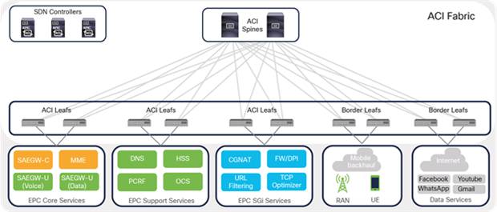

# Lab X- Calling Settings


## Available Settings

| Calling Settings |
| --- |
| Service Settings | Override | On by default |
| Voicemail – defaults for voicemail forwarding/deletion/passcodes | No | Default Setting |
| **Manage User Calling Data – point out a couple of simple things to edit in the bulk file | Yes, with CSV | N/A |
| **Device Line Key templates- Create line key for 9851 to use later when we add devices | With device template | N/A |
|  |
| --- |
| Client Settings | Override | On by default |
| **In-call feature access | With calling template | Yes |
| DND Status Sync | No | Yes |
| **Hide Calling Settings | At user level only | All options on |
| Calling Template |
| --- |
|  |  | On by default |
| **In-call feature access |  | All options on |
| Microsoft Team Integration – off |  | No |
| Emergency call disclaimer - off |  | No |

Calling Settings Tasks:

Client Settings

Confirm in-call feature access

| User.webex.com -> Settings -> CallingControl Hub -> Services-> Calling-> Client settings-> Hide Calling Settings | In a new tab: Log in as Charles Holland (your admin log in credentials)Call Settings – Note that the Block Caller ID setting is availableVoicemail – Note all voicemail settings are available.Company policy dictates that users cannot block their caller id or manage any of their voicemail settings in the Webex App and/or User Hub (user.webex.com)In control hub:Call settings – disable Block Caller IDVoicemail – disable all voicemail featuresGo to User.webex.com, log in as Charles Holland (your admin log in credentials) to check that the settings have been removed. (You may need to reload the page or log out/back in. Changes could take a few minutes) |
| --- | --- |
| Services-> Calling-> Client settings-> Templates -> Create template | XYZ group should not be able to share content or request/give remote control of shared content.Template name: Disable SharingDisable:Request remote controlGive remote controlScreen sharingApply template to XYZ group |

Service Settings

| Services-> Calling-> Service settings-> Voicemail | IT security policies dictate that voicemail passwords be reset at a regular interval.Set the number of days after which passcode expires to 30 |
| --- | --- |
My content

!!! note
    This is a note

Cisco IOS code block:

```ios
hostname ABC
interface GigabitEthernet1
 ip address 122.1.1.1
```


Image:

<figure markdown>
  { width="500" }
</figure>

## Section 2

More content
